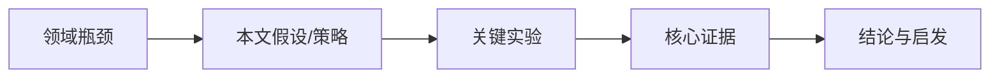

---
name: litflow
description: "Use when the user provides academic PDFs, Zotero/Obsidian paper folders, or asks for 文献精读, 论文精读, 带图精读, 批量精读, 文献综述, review, 方法提炼, 创新点归类, synthesis methods, device setup, or research-note generation. Produces Chinese Obsidian notes with full-paper reading, cropped key figures, concept notes, people profiles, method notes, innovation clustering, and cross-paper synthesis."
---

# LitFlow 文献精读

Read academic PDFs deeply and save usable Obsidian notes. Default output is Chinese, professional but readable, with cropped figures and durable links between papers, concepts, methods, innovation clusters, and people.

## Abstract Triage (Stage 0)

**Before** deep reading, always triage first. This takes ~10 seconds and determines the entire reading strategy.

### Step 1: Extract metadata

From the first 1-2 pages, extract:
- Title, authors, journal, year
- Abstract (full text)
- Keywords (if listed)
- Paper type signals (see classification below)

### Step 2: Classify

**Paper type** — pick ONE:

| Type | Signals | Deep-read focus |
|------|---------|----------------|
| `research` | Reports new experimental/computational results; has Methods section | Full template: background→strategy→results→innovation |
| `review` | Survey/overview of a field; no new experiments; long reference list | Add: 技术路线演进表, 横向对比表, 未解决问题, 设计原则 |
| `theory` | Proposes or derives a theoretical model; heavy math/equations | Add: 模型假设, 推导逻辑, 与实验对照, 适用范围 |
| `perspective` | Commentary, outlook, or opinion piece; short reference list | Add: 领域预判, 争议点, 作者立场, 未来方向 |
| `method` | Reports a new technique/method; benchmarking against existing methods | Add: 方法原理, 适用条件, 性能对比, 使用门槛 |

**Research field** — pick the closest match:

| Field | Key metrics to extract | Note emphasis |
|-------|----------------------|---------------|
| `electrochemistry` | V, mAh/g, mA/cm², CE, cyclability | Performance tables, rate capability |
| `computation` | eV, kcal/mol, convergence, basis set | Method details, error analysis, experiment comparison |
| `synthesis` | yield, selectivity, T, solvent, substrate scope | Reaction conditions, scope table |
| `materials` | conductivity, bandgap, stability, morphology | Structure-property relationships |
| `biology` | IC₅₀, p-value, n, knockdown efficiency | Statistical rigor, controls |
| `general` | — | Standard template |

### Step 3: Present triage card

Output a compact triage card before proceeding:

```
📋 分诊卡
─────────────────────────────
类型: research / review / theory / perspective / method
领域: electrochemistry / computation / synthesis / ...
期刊: ... (IF≈...)
推荐策略: 标准精读 / 重点看方法 / 重点看理论推导 / ...
关注重点: [2-3 个关键词]
预计图表: 3-5 张（推荐 ...）
─────────────────────────────
```

Read `references/abstract-triage.md` for signal-word classification hints and boundary cases.

**For batch mode**: Run triage on ALL papers first, present a summary table, then process sequentially. This lets the user adjust priorities or skip papers before heavy work begins.

### Step 4: Select template variant

Based on classification, select which sections to include:

**Core sections** (always present):
- 一句话总览, 主线逻辑链, 速读卡, 逻辑地图, 研究背景, 关键图表, 不足与评价, 关键概念, 人物团队, 可复用启发

**Type-specific sections** (conditional):

| Paper type | Add these sections |
|---|---|
| `research` | 研究策略, 创新点 (evidence table), 关键数据 (performance table) |
| `review` | 技术路线演进, 横向对比表, 设计原则, 未解决问题 |
| `theory` | 模型假设, 核心推导, 与实验对照, 适用范围与局限 |
| `perspective` | 领域预判, 争议点, 作者立场, 未来方向 |
| `method` | 方法原理, 实现细节, 性能对比, 使用门槛与建议 |

**Field-specific data table columns** (override "关键数据" table):

| Field | Table columns |
|---|---|
| `electrochemistry` | 指标 \| 数值 \| 条件/对照 \| 意义 |
| `computation` | 参数 \| 数值 \| 方法/基组 \| 收敛性 |
| `synthesis` | 反应条件 \| 产率 \| 选择性 \| 备注 |
| `materials` | 性能指标 \| 数值 \| 测试条件 \| 对比材料 |
| `biology` | 指标 \| 效果量 \| 统计 \| 对照 |
| `general` | 指标 \| 数值 \| 条件 \| 意义 |

## Core Workflow

For each paper:

1. **Triage** using the Abstract Triage workflow above.
2. Extract full body text with `pymupdf`; skip only References/SI when clearly separated.
3. Extract 3-5 key figures or tables with the caption-anchored workflow in `references/pdf-image-workflow.md`; save final crops to `<OBSIDIAN_VAULT>\\99-Attachments\\`.
4. Load `references/concept-glossary.md` and `references/entity-note-workflow.md` before writing; avoid re-explaining known concepts and prepare the concept/people candidate table.
5. Write a coherent 1500-2000 Chinese-word note using the aesthetic Obsidian layout in `references/note-design-style.md`.
6. Run the **Entity Note Gate**: create/update concept notes in `<OBSIDIAN_VAULT>\\02-Concepts\\` and people notes in `<OBSIDIAN_VAULT>\\03-People\\`, then verify that each non-paper concept/person wikilink target file exists. Do not finish the paper note until the entity gate passes.
7. If no concept or people notes are created or updated, record the reason in the working checklist (for example: all candidates already existed, no reusable concepts, or no identifiable important author/team).
8. Create/update method notes in `<OBSIDIAN_VAULT>\\04-Methods\\` for reusable synthesis, fabrication, device, characterization, computation, or data-analysis methods. Read `references/method-workflow.md` before creating or merging method notes.
9. Create/update innovation index entries in `<OBSIDIAN_VAULT>\\07-Innovations\\` for lightweight innovation clustering. Read `references/innovation-workflow.md` before adding entries; do not perform deep lineage tracing by default.
10. Save the paper note to `<OBSIDIAN_VAULT>\\01-Papers\\` with frontmatter, `[[wikilinks]]`, and embedded `![[figure.png]]` images.

Before processing, check whether `<OBSIDIAN_VAULT>\01-Papers\` already contains a same-title or same-DOI note. Skip duplicates unless the user asks to regenerate.

Default new-paper reading only checks the current paper. Do not scan historical paper notes during normal reading, and do not perform broad semantic comparison against the whole concept/people library unless the user asks for backfill, repair, or review-level consolidation.

## Obsidian Vault

Use this structure by default:

```text
<OBSIDIAN_VAULT>\
  00-Inbox\
  01-Papers\
  02-Concepts\
  03-People\
  04-Methods\
  05-MOC\
  06-Templates\
  07-Innovations\
  99-Attachments\
```

Treat these as configurable paths. On first use, ask the user where their Obsidian vault and Zotero storage live; do not assume any machine-specific path:

- `OBSIDIAN_VAULT`: user-selected Obsidian vault path
- `PAPERS_DIR`: default `<OBSIDIAN_VAULT>\01-Papers`
- `CONCEPTS_DIR`: default `<OBSIDIAN_VAULT>\02-Concepts`
- `PEOPLE_DIR`: default `<OBSIDIAN_VAULT>\03-People`
- `METHODS_DIR`: default `<OBSIDIAN_VAULT>\04-Methods`
- `INNOVATIONS_DIR`: default `<OBSIDIAN_VAULT>\07-Innovations`
- `ATTACHMENTS_DIR`: default `<OBSIDIAN_VAULT>\99-Attachments`
- `ZOTERO_STORAGE`: optional Zotero storage path, only if the user uses Zotero

## First-Use Permissions

Ask for the user's permission before installing any missing plugin, package, or external dependency. Do not install anything silently.

Useful optional capabilities:

- Python packages: `pymupdf` for PDF text/rendering and `Pillow` for image QA/cropping.
- Obsidian: optional CSS snippets support for `assets/obsidian-snippets/literature-reading.css`.
- Zotero: optional local storage access if the user wants to read PDFs from Zotero folders.
- External figure tools: PDFFigures2, GROBID, Docling, PaddleOCR, or Poppler only when the user explicitly approves the install/use.

## Paper Note Template

Save as:

```text
<OBSIDIAN_VAULT>\01-Papers\<FirstAuthor> <Year> - <Short Chinese Title> (<Journal> 精读版).md
```

Use this structure. Keep it elegant and scan-friendly; read `references/note-design-style.md` before writing the final note.

```markdown
---
type: paper
paper_type: research | review | theory | perspective | method
research_field: electrochemistry | computation | synthesis | materials | biology | general
title: "Original English Title"
authors: ["Author1", "Author2"]
year: 2026
journal: "Journal Name"
doi: "10.xxxx/xxxxx"
tags: [paper]
status: 已精读总结
rating: 1-5
pdf_path: "original PDF path"
summary_date: YYYY-MM-DD
cssclasses: [paper-note, literature-card]
---

# Original English Title

> [!summary] 一句话总览
> 用 2-3 句中文说明这篇论文解决什么问题、用了什么策略、最重要结论是什么。

> [!important] 读这篇文章要抓住的主线
> **问题** → **策略** → **证据** → **结论**：用一行写出论文的逻辑链。

| 项目 | 信息 |
|---|---|
| 作者 | ... |
| 年份/期刊 | ... |
| 机构 | ... |
| 通讯/PI | [[Person Name]] |
| DOI | https://doi.org/... |
| 关键词 | `keyword-1` `keyword-2` |

## 速读卡

| 维度 | 内容 |
|---|---|
| 核心问题 | ... |
| 研究策略 | ... |
| 关键结果 | ... |
| 主要创新 | ... |
| 局限/疑问 | ... |

## 逻辑地图



## 研究背景与内容

Use 2-4 coherent paragraphs. Explain the broad background, narrower scientific problem, why existing approaches are insufficient, and what the authors did.

## 研究策略

Explain the design logic, materials/system, experimental route, and why this strategy should work.

## 创新点

| 创新点 | 证据/数据 | 为什么重要 |
|---|---|---|
| ... | ... | ... |

## 关键图表

### Fig 1 - Short figure title
![[Author_Year_Fig1.png]]
> [!note] 图表解读
> 这张图展示了什么、支撑了哪一个结论、读者应该看哪里。

### Fig 2 - Short figure title
![[Author_Year_Fig2.png]]
> [!note] 图表解读
> ...

## 关键数据

| 指标 | 数值 | 条件/对照 | 意义 |
|---|---:|---|---|
| ... | ... | ... | ... |

## 不足与评价

Discuss limitations, unanswered questions, and what follow-up work would be valuable.

## 关键概念链接

- [[Concept1]] - one-sentence relevance

## 人物与团队

- [[Person Name]] - 通讯作者/PI，主要方向：...

## 实体链接检查

- Concepts created/updated: [[Concept1]]; if none, explain why.
- People created/updated: [[Person Name]]; if none, explain why.
- Entity Note Gate: checked that each non-paper concept/person wikilink target file exists in `02-Concepts` or `03-People`.

## 可复用方法与装置

- [[Method Note Name]] - 本文使用/改造了什么方法，关键变化是什么。
- 如果只是材料名不同而工艺本质相同，链接已有 method note，并把本文作为“文献变体”追加进去。

## 创新点归类

- 分类：机制创新 / 材料创新 / 器件-方法创新 / 装置-系统创新
- 小类：例如反应路径调控、界面电荷转移调控、缺陷工程、流动体系设计等。
- 一句话创新点：用一句话说明本文的新意；溯源只写可选备注，不默认展开。

## 可复用启发

- 可借鉴的实验设计：
- 可迁移的方法/材料：
- 后续可以追的问题：

## 相关信息

- **PDF 文件**: filename.pdf
- **DOI 链接**: https://doi.org/...
```

## Figure Handling

Figures are mandatory for paper notes. Text-only notes are incomplete.

Default rule: run `scripts/robust_pdf_figure_extract.py` first and save final images in `tight` mode. The robust extractor combines embedded-image inventory, caption-anchored crop inference, table/figure direction locks, same-row caption isolation, vector drawing detection, and pixel-segment fallback. It supports `Figure/Fig/Table/Scheme`, `Extended Data`, `Supplementary`, and Chinese `图/表` captions.

Treat the script output as a first pass, then visually QA and adjust any bad crop. Use `caption-lite` only when the figure label/title is useful and does not pull in正文; use `full-caption` only when the full caption is directly attached and clean. Prefer `tight` crops for Obsidian/PPT reuse and keep caption meaning in the Markdown interpretation callout.

Use the older `scripts/caption_anchor_crop.py` only as a lightweight fallback or comparison tool.

Reject whole-page screenshots as final figures unless the entire page is truly a full-page figure. Same-sized page-like PNGs, text-heavy crops, caption-only pages, and crops containing mostly two-column正文 must be recropped.

When a caption and artwork are split across pages, crop the artwork page in `tight` mode and write the caption/interpretation below the image in Markdown. Do not stitch a caption-only page into the image.

Select 3-5 high-value visuals:

- Conceptual schematic or research design
- Main performance plot or key comparison
- Mechanism/model/DFT/MD figure
- Summary table with important metrics

Skip routine supplementary plots unless they are central evidence.

Read `references/pdf-image-workflow.md` when rendering pages, generating crop candidates, identifying crop coordinates, writing crop scripts, or debugging figure extraction. Read `references/advanced-pdf-figure-extraction.md` when auto-crop fails, when deciding between raw embedded images and figure-area screenshots, or when considering external tools such as PDFFigures2, GROBID, Docling, or PaddleOCR.

If auto-crop fails (vector-only figures, page-header-only output), use the manual fallback workflow in `references/manual-crop-fallback.md`: render pages → vision-based coordinate identification → pymupdf crop → QA.

Read `references/practical-pitfalls.md` before starting any batch run — it covers file-naming gotchas (Chinese characters break vision tools), overlapping author prefixes, review-paper figure overload, and subagent delegation patterns.

## Note Design

Use an Obsidian-native visual hierarchy: a short summary callout, visual logic map, compact metadata table, key result table, figure interpretation callouts, and restrained wikilinks. Avoid decorative clutter.

Read `references/note-design-style.md` before producing final paper notes or literature review notes.

Optional: copy `assets/obsidian-snippets/literature-reading.css` into the vault's `.obsidian/snippets/` folder and enable it in Obsidian for a more polished reading-card style.

## Concept Notes

Use concept notes only for genuinely useful, reusable concepts. Do not create notes for common terms.

Read `references/entity-note-workflow.md` before creating, updating, or linking concept notes. Concept wikilinks in paper notes must point to actual files in `<OBSIDIAN_VAULT>\02-Concepts\`.

Save to:

```text
<OBSIDIAN_VAULT>\02-Concepts\<ConceptName>.md
```

Use this structure:

```markdown
---
type: concept
name: <概念名>
aliases: [<English Name>]
tags: [concept]
created: YYYY-MM-DD
updated: YYYY-MM-DD
---

# 概念名 (English Name)

## 定义

## 基本原理

## 在当前研究方向中的意义

## 相关论文
- [[Paper Note Name]] - 首次出现或重要应用
```

Also append compact entries to `references/concept-glossary.md` to prevent repeated explanations.

## People Notes

Use `03-People` to track important researchers, not every author. Prioritize:

- Corresponding authors
- Group leaders/PIs
- First authors who repeatedly appear in the field
- Authors the user may want to contact
- Labs that define a technical route

Read `references/entity-note-workflow.md` and `references/people-workflow.md` when creating or updating people notes. People wikilinks in paper notes must point to actual files in `<OBSIDIAN_VAULT>\03-People\`.

## Entity Backfill Mode

Backfill is non-default and must be explicitly requested by the user. Use Entity Backfill Mode only when the user says previous paper notes did not correctly create `02-Concepts` or `03-People` entries, asks to scan old papers, or specifies a repair scope. Read `references/entity-note-workflow.md`, scan only the user-specified paper notes or folder in `<OBSIDIAN_VAULT>\01-Papers\`, find concept/person wikilinks with missing target files, then create/update the missing concept and people notes from the paper-note context. Report what was repaired and what still needs manual source checking.

## Method Notes

Use `04-Methods` to track reusable experimental and computational methods, not one-off material recipes. Prioritize:

- Materials synthesis, fabrication, and post-treatment routes
- Device, reactor, cell, fixture, and in-situ/operando setup designs
- Characterization and testing protocols
- Computation and data-analysis workflows
- Methods that recur across papers with only material names, precursors, or parameter windows changed

Read `references/method-workflow.md` before creating or updating method notes. Do not create a new method note when the new paper uses the same method family and mechanism with only material-specific substitutions; update the existing method note's `文献变体` table instead.

## Innovation Indexes

Use `07-Innovations` to cluster paper innovations into four fixed index files:

- `机制创新.md`
- `材料创新.md`
- `器件-方法创新.md`
- `装置-系统创新.md`

Create/update innovation index entries after reading each paper. Default behavior is lightweight clustering: choose 1-2 categories, place similar innovation points under the same subsection, and write one sentence per paper. Do not perform deep lineage tracing by default; use the `可选备注` column only for short source clues such as "可能借鉴流动电池思路" or "待追溯".

Read `references/innovation-workflow.md` before updating innovation indexes.

## Batch Mode

When given a folder:

1. **Triage all papers first**: Extract title + abstract from each PDF, classify paper_type and research_field, present a summary table.
2. Show the triage table to the user with recommended reading strategy per paper.
3. Process papers continuously in the order shown; do not ask after every paper.
4. Skip already-processed papers by title/DOI.
5. Merge repeated methods across papers into `04-Methods` before writing the final cross-paper summary.
6. Cluster repeated innovation patterns into `07-Innovations` before writing the final cross-paper summary.
7. After all notes are generated, provide a short cross-paper comparison and identify candidate MOC/review themes.

**Batch triage table format:**

| # | 论文 | 类型 | 领域 | 推荐策略 | 图表 | 状态 |
|---|------|------|------|---------|------|------|
| 1 | FirstAuthor 2024 - ... | research | electrochemistry | 标准精读 | 4 | 待处理 |
| 2 | Author 2023 - ... | review | materials | 重点看对比表 | 3 | 待处理 |

## Literature Review Mode

Use review mode when the user asks for 文献综述, review, 逻辑框架, 技术路线, or cross-paper synthesis.

Do not stitch individual summaries together. Build an independent logic line:

- What is the central bottleneck?
- What technical routes exist?
- How did the field evolve?
- Which design principles repeat across papers?
- What metrics can be compared horizontally?
- What remains unresolved?

Use a comparison table and a logic/thread diagram when useful. Read `references/semantic-scholar-api.md` or the `arxiv` skill when supplementary literature search is needed.

## PDF/Text Commands

Prefer script-file execution for larger PDFs because inline commands can time out.

Minimal text extraction pattern:

```python
import pymupdf

doc = pymupdf.open("paper.pdf")
text = "\n".join(doc[p].get_text() for p in range(max(0, len(doc) - 2)))
```

Before first batch work, check:

```bash
python -c "import pymupdf, PIL"
```

If missing, ask for the user's permission before installing `pymupdf` or `Pillow`. Ask for explicit approval before installing or invoking any optional external PDF/OCR/figure-extraction tool.

## Quality Checks

For individual paper notes:

- Abstract Triage was performed: paper_type and research_field are classified before deep reading.
- Full body text was read; no selective skipping except References/SI.
- Note is 1500-2000 Chinese words or roughly 5-6 KB.
- Writing is coherent prose, not a numbered outline.
- At least 3 specific numerical results are included.
- 3-5 cropped figures are embedded with `![[filename.png]]` syntax and explained.
- Crops are QA checked: complete figure body, no unrelated正文段落, no page headers/footers, and no caption-only or text-page screenshots.
- Figure filenames match the actual figure numbers after visual review. If `Fig1`, `Fig2`, etc. all have identical page-like dimensions, stop and recrop from the PDF.
- The note follows the aesthetic layout: summary callout, metadata table, speed-read card, key figures, key data, concepts, people, and reusable insights.
- **Type-appropriate sections are present**: research→策略+创新点+数据表, review→演进表+对比表+未解决, theory→假设+推导+对照, perspective→预判+争议, method→原理+对比+门槛.
- **Field-appropriate data table columns** are used (e.g., yield for synthesis, CE/cyclability for electrochemistry).
- Figures are actual image embeds (`![[...]]`), not just text descriptions of what the figure shows.
- Concepts are linked without glossary bloat.
- Important people are linked in `03-People`.
- Entity Note Gate passed: the concept/people candidate table was completed, notes were created or updated before finalizing the paper note, and every non-paper concept/person wikilink target file exists in `02-Concepts` or `03-People`.
- If no concept or people notes are created or updated, the reason is explicitly recorded in the working checklist or `实体链接检查` section.
- Reusable synthesis, device, characterization, computation, or data-analysis methods were checked against `04-Methods`; new method notes are created only when the method fingerprint is genuinely new.
- Paper notes link relevant method notes under `可复用方法与装置` when a reusable method appears.
- Innovation points were clustered into `07-Innovations` when the paper has a clear novelty claim; entries use one-sentence innovation summaries and similar innovations are grouped under the same subsection.
- Frontmatter and file names are clean enough for Obsidian search.

For review notes:

- The review has a logic line, not paper-by-paper stacking.
- A cross-paper comparison table is present.
- All cited papers are listed.
- External literature search is clearly separated from user-provided papers.

## Common Pitfalls

- Do not skip Abstract Triage — classifying the paper type first prevents using the wrong template (e.g., applying a research template to a review paper).
- Do not force "研究策略" and "创新点" sections onto review/theory papers — use the type-specific sections instead.
- Do not output text-only notes.
- Do not use whole-page screenshots as the default.
- Do not explain common terms such as electrochemistry unless the paper uses them unusually.
- Do not create duplicate concept/person notes with slightly different names.
- Do not only write concept/person names in the paper note; the target files in `02-Concepts` and `03-People` must be created or updated and then verified.
- Do not delegate concept/people creation to a subagent without post-run verification by the main agent.
- Do not create material-name method notes when only the material changes. Generalize to the method family, then add the material-specific paper as a variant.
- Do not spend default reading budget on deep innovation lineage tracing. Put short clues in `可选备注` and leave full tracing for explicit review/synthesis tasks.
- Do not overfit a note to one domain; preserve the paper's actual claims and evidence.
- Do not treat `03-People` as a contact list only. It is a researcher/team map: who they are, what they work on, what they have done, and why they matter.
- Do not let subagents describe figures in prose only — every figure must be embedded with `![[filename.png]]` syntax in the note. Check before considering a note complete.
- Do not use the same ASCII prefix for two papers by the same first author. Always include the year or a short title token, such as `AuthorA2023`, `AuthorA2025`.
- Do not skip the batch triage table — when processing folders, triage ALL papers first before starting any deep reads. The user may want to reorder, skip, or prioritize.
- Do not trust auto-crop blindly on vector-heavy PDFs — `robust_pdf_figure_extract.py` detects raster image blocks, vector drawings, captions, and pixel segments, but some PDFs still require manual rendering + vision-based coordinate identification. If auto-crop produces figures that only show page headers or caption labels without the actual content, fall back immediately. ALWAYS visually QA auto-cropped figures before using them — check at least 2-3 crops per paper.
- Do not let subagents skip image embed syntax — when delegating note writing, explicitly state in the prompt that every `> [!note]` callout MUST have a `![[filename.png]]` line immediately before it. Without this, subagents write the prose解读 but forget the actual image embed. Verify post-delegation by searching for `!\[\[` in each note file.
- **Auto-crop can still fail on vector-heavy PDFs**. The `robust_pdf_figure_extract.py` script is stronger than the legacy cropper, but many modern papers render figures as text/vector composites. When auto-crop produces full-page text renders instead of figure crops, fall back to manual workflow immediately: render all pages at 200 DPI → identify figure locations → crop at 300 DPI. Do NOT trust delegated auto-crop results without QA — visually verify at least 2-3 crops per paper.
- **SI figures**: Some papers (especially "Article in Press" versions) put all figures in the Supplementary Information section rather than inline in the main text. If the main body pages (3-10) show only text/equations, check the SI pages (usually after references) for the actual figures with captions.
- **Pixel-level content detection for precise cropping**: Instead of guessing percentage coordinates visually, use numpy to detect non-white pixel rows in rendered pages. This finds exact content segments (figure panels vs caption vs body text vs headers). Key pattern for "Article in Press" PDFs: (1) Segment 0 at y=1.4%-3.3% is always the "ARTICLE IN PRESS" banner — skip it. (2) Figure panels typically occupy the middle 30-40% of the page. (3) Caption text is 1-2 segments below the panels. (4) Body text segments appear after the caption with clear gaps. Crop from just above the first panel segment to just below the last caption segment, excluding both header and body text. See this code pattern:
```python
import numpy as np
non_white = np.any(img < 230, axis=2)
row_density = np.sum(non_white, axis=1) / pix.width
content_rows = np.where(row_density > 0.02)[0]
diffs = np.diff(content_rows)
gaps = np.where(diffs > 10)[0]
# Segments between gaps are figure panels, captions, or body text
```
- **"Article in Press" watermark removal**: For Nature/ACS papers in press, the banner appears at y=1.4%-3.3% of every page. Always start crops at y≥5% to skip it.


